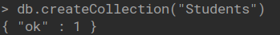
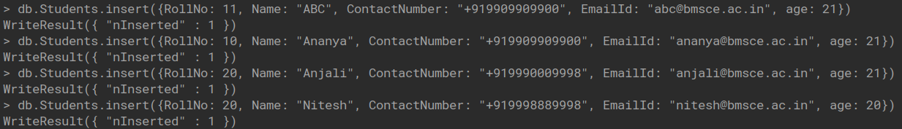
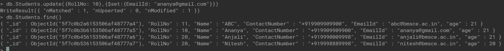
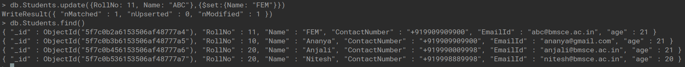
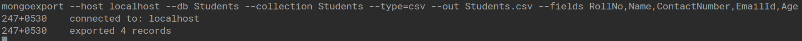
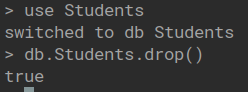
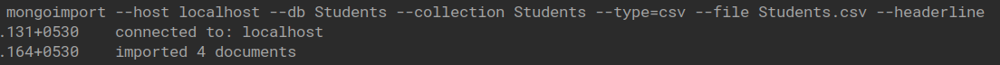
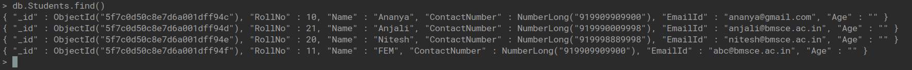
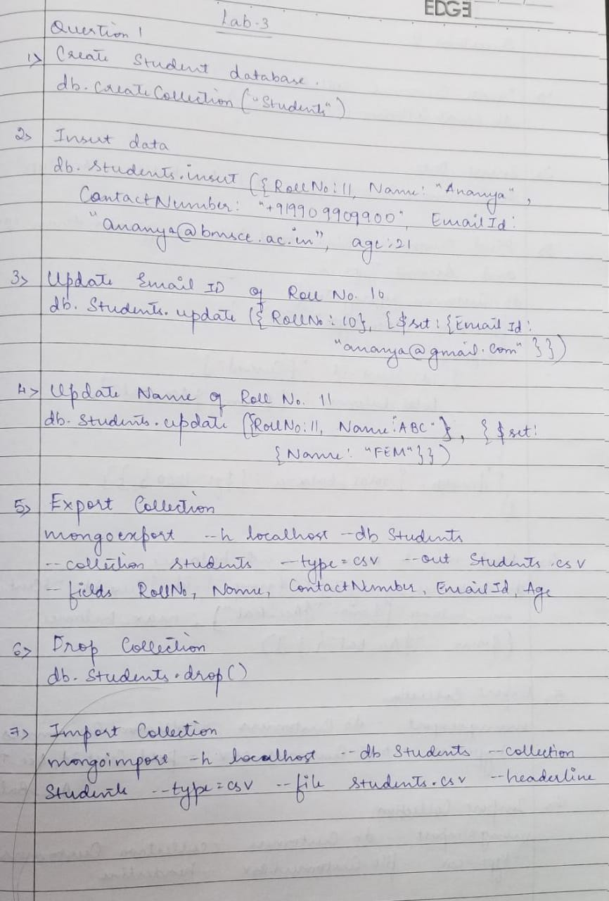

## Mongo DB

### College Database

1. Create Student Collection

   

2. Student Collection Insert

   

3. Update Email ID of Roll No. 10

   

4. Update Name of Roll No. 11

   

5. Export Collection

   

6. Drop Collection

   

7. Import Collection

   

8. View Collection After Importing

   

## Write Up

