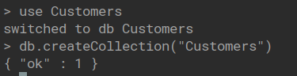
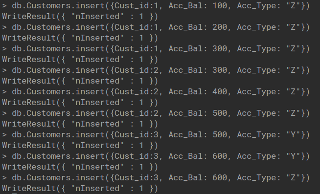
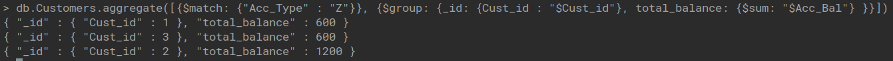
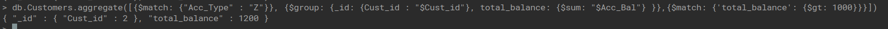
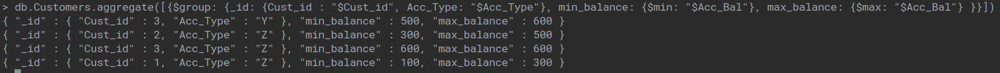
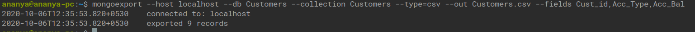
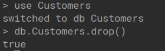
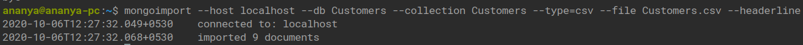
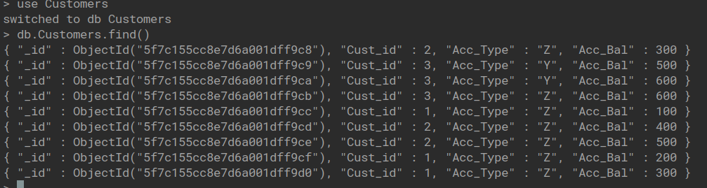

## Mongo DB

### Customers Database

1. Create Customer Collection

   

2. Insert Data

   

3. Find Total Balance of Customers with Account Type Z

   

4. Find Customers with Total Balance greater than 1000 and Account Type Z

   

5. Find Minimum and Maximum Account Balance

   

6. Export Collection

   

7. Drop Collection

   

8. Import Collection

   

9. View Collection After Importing

   

<!-- ## Write Up -->

<!--  -->
