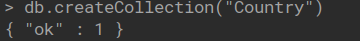
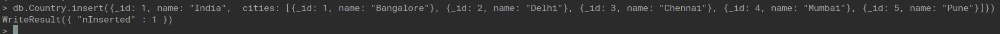
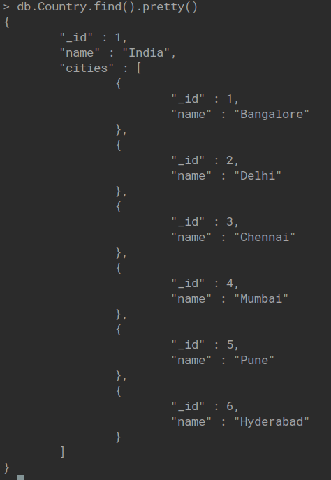
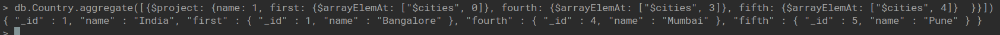
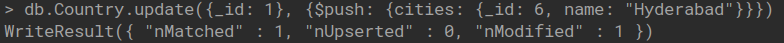
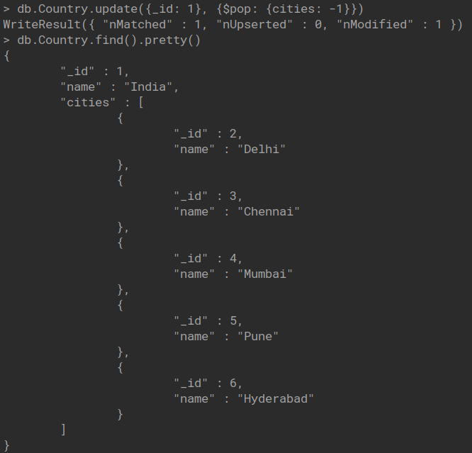
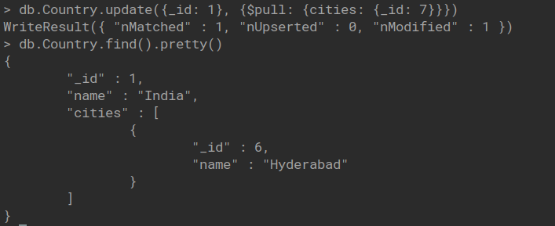
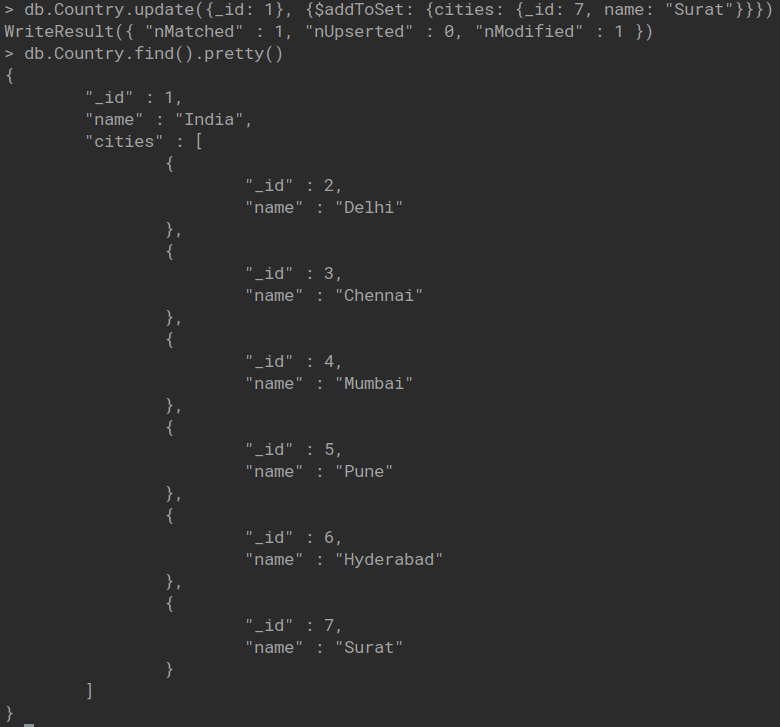
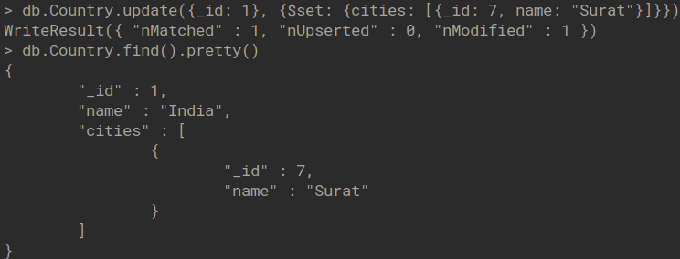

## Mongo DB

### Array Operations

1. Create Collection

   

2. Insert Data

   

3. View Data

   

4. Print First, Fourth and Fifth Document

   

5. Push Operation

   

6. Pop Operation

   

7. Pull Operation

   

8. Update using addToSet

   

9. Update using set

   
