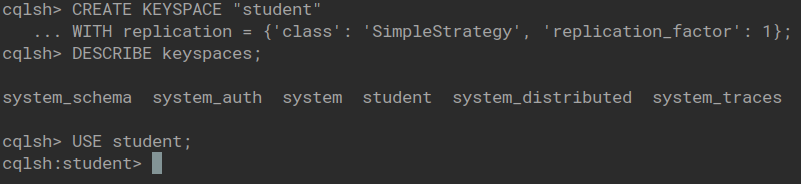
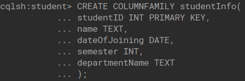
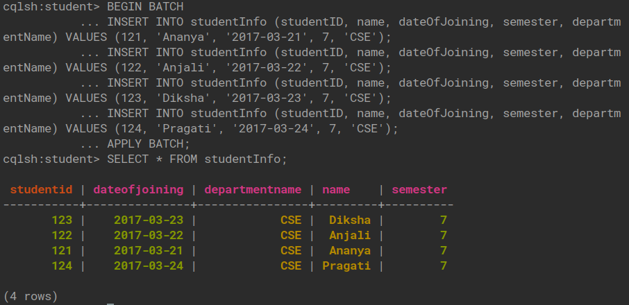
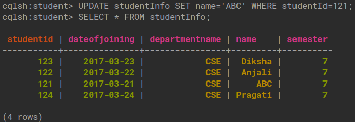

## Cassandra Lab

### Student Keyspace

1. Create a Keyspace by name **Student**
   

2. Create a Column Family by name **studentInfo** with attributes studentID, name, dateOfJoining, semester, departmentName
   

3. Insert values into column family **studentInfo** in batch
   

4. Update **name** of studentID 121
   
