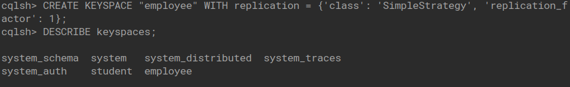

## Cassandra Lab

### Employee Keyspace

1. Create a Keyspace by name employee

   

2. Create a Column Family by name employeeInfo with attributes employeeID, name, designation, dateOfJoioning, salary and department.

   

3. Insert values into column family employeeInfo in batch

   

4. Update Employee name and Department of employeeID 121

   

5. Alter the schema of the table Employee_Info to add a column Projects which stores a set of Projects done by the corresponding Employee.

   

6. Update the altered table to add project names.

   

7. Create a TTL of 15 seconds to display the values of Employees.

   
