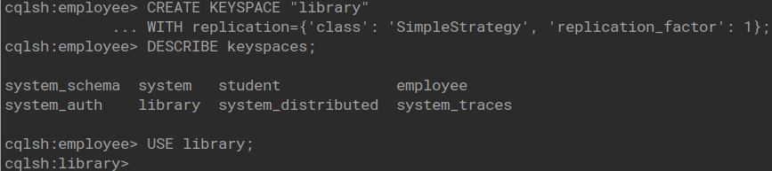
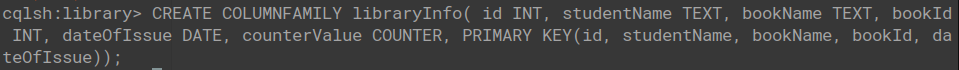
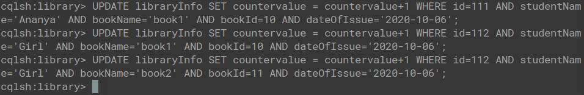
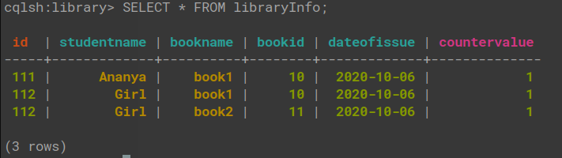
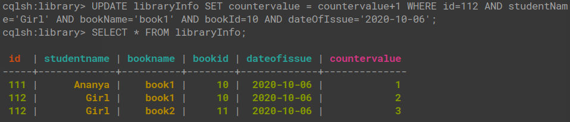
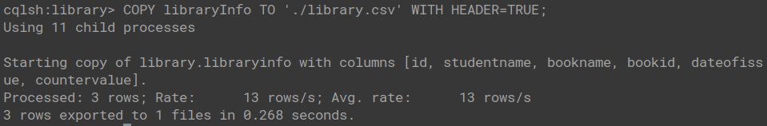
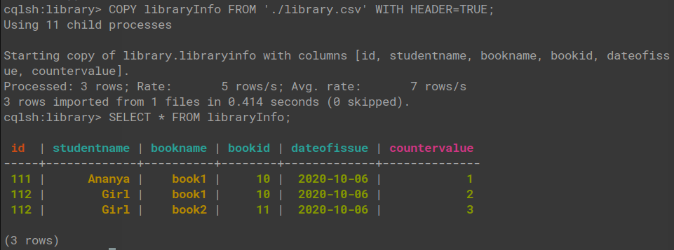

## Cassandra Lab

### Library Keyspace

1. Create a Keyspace by name library

   

2. Create a column family by name LibraryInfo with attributes id Primary Key, counterValue of type Counter, studentName bookName, bookId, dateOfIssue

   

3. Insert values.

   

4. Display the details of the table created and increase the value of the counter

   

   

5. Export the created column to a csv file

   

   The CSV file can be found [here](library.csv)

6. Import a given csv dataset from local file system into Cassandra column family

   
