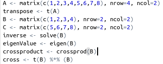
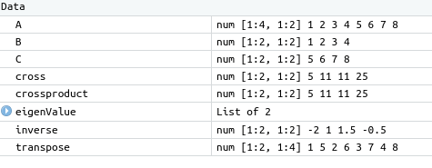
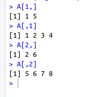
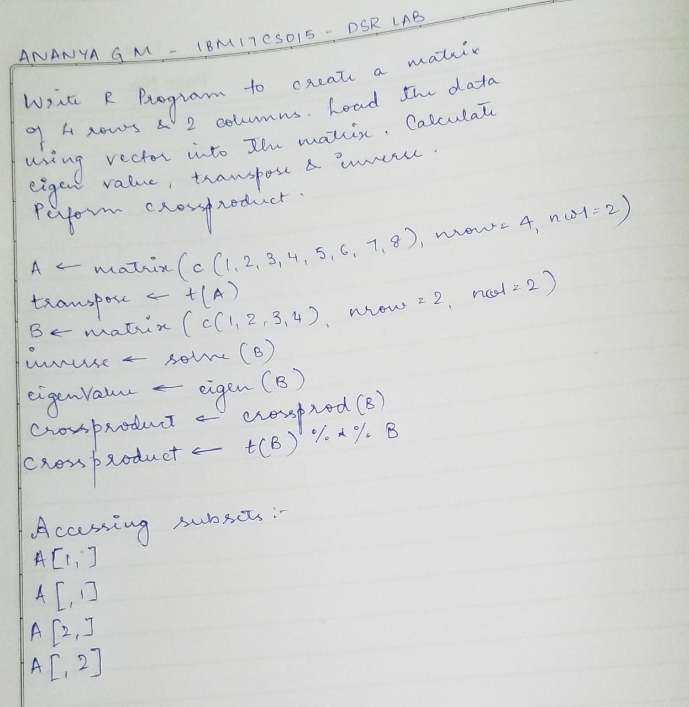

## R Matrix Operation

##### Write R program to create a matrix of 4 rows and 2 columns. Load the data using vector into the matrix. Calculate transpose, eigen value, inverse and crossproduct. Access Matrix Subsets

1. Code

   

2. Variables

   

3. Subsets

   

## Write Up

