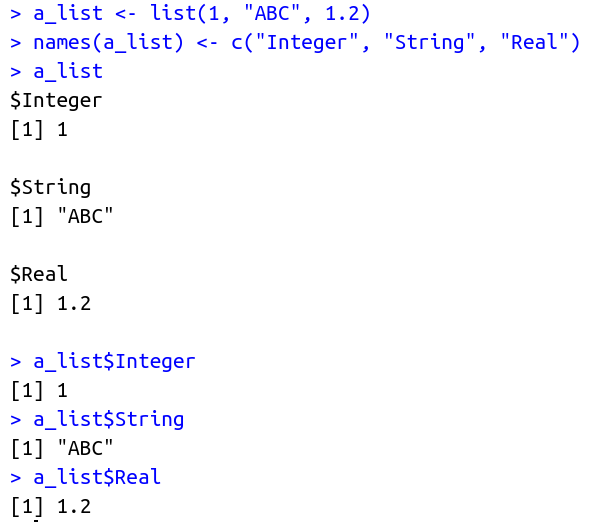

## Lab 4

#### Question 1

Create a matrix object from the data that is given in the above question 2. Make a List using the plant names from above as an object to include in the list along with the original data.

#### Output

#### Question 2

Create a List of data objects of type Numeric , String, Real Numbers and name them.

#### Output

#### Question 3

Import a Csv file churn_modelling.csv file facotrize the estimated column to different levels as Low,Mediun and High.
The conditions are if Estimated value is less than 10000 categorize it as low If the estimated value is above 10000 and below 100000 categorize it as medium and if above 100000 categorize it as High Add the factored variable to the origanl dataset and export the file.

#### Output

The exported file can be found [here (ModifiedData.csv)](ModifiedData.csv)
