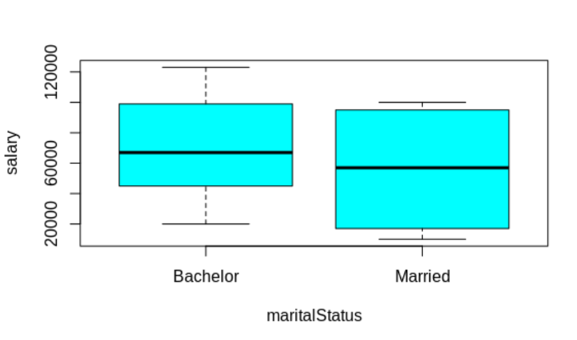
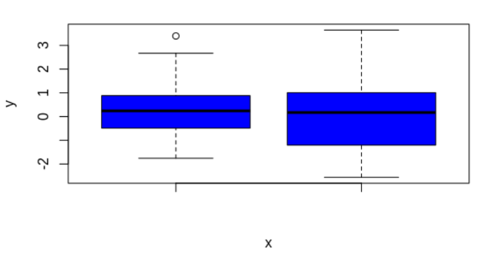
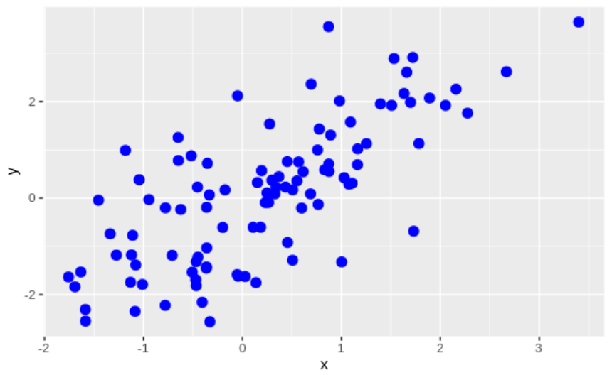

## Lab 5

#### Question 1

Create a Data Frame of three columns EMPID, SALARY, MARTIAL STATUS of 10 values for each column. Draw a boxplot for salary column for different categories of Martial status (Married, Bachelor).

#### Code

The program can be found [here (Question1.R)](Question1.R)

#### Output

#### Question 2

Draw a boxplot selecting random numbers of 100 points from a Normal Distribution with mean=0 and sd=1.Draw a scatterplot where size of each point is 3 , colour=Blue. Give the appropriate titles for x-axis and y-axis.

#### Code

The program can be found [here (Question2.R)](Question2.R)

#### Output

**Box Plot**

**Scatter Plot**

