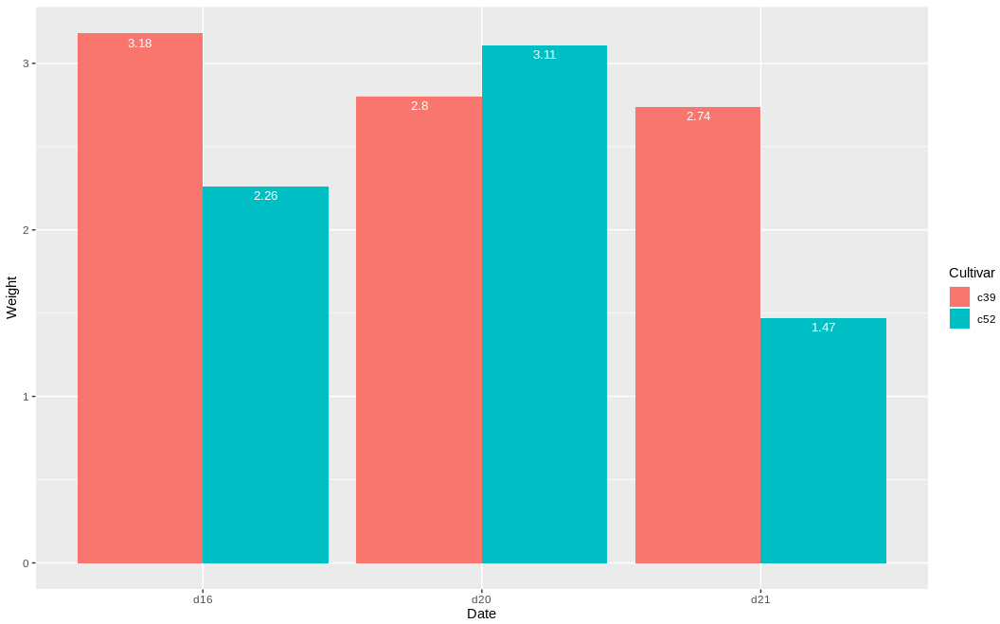
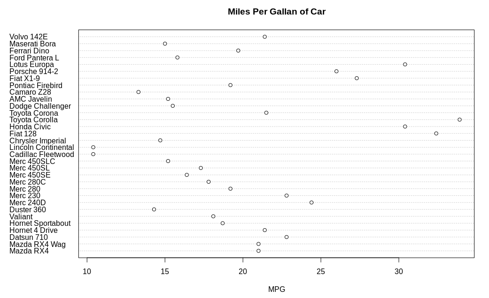

## Lab 6

#### Question 1

Using the dataset Cabbage_Exp(imported from library gcookbook) create a bargraph for the cultivar field of Cabbage_Exp.

#### Code

The program can be found [here (Question1.R)](Question1.R)

#### Output

#### Question 2

Create a dotchart from the Mtcars which is loaded from ggplot2 package. Plot the Y axis by naming the different types of Mtcars against MPG values against x-axis

#### Code

The program can be found [here (Question2.R)](Question2.R)

#### Output

