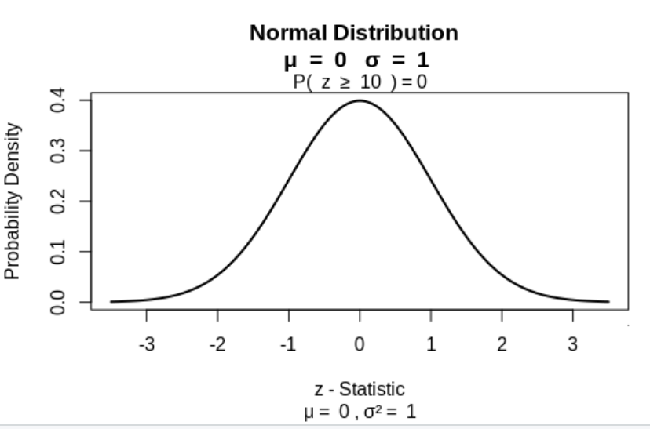
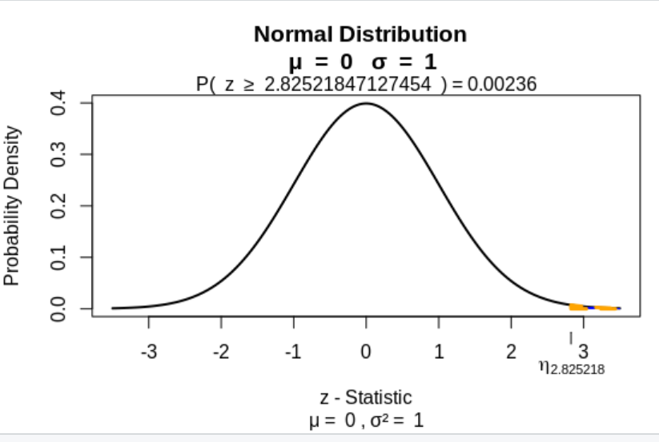
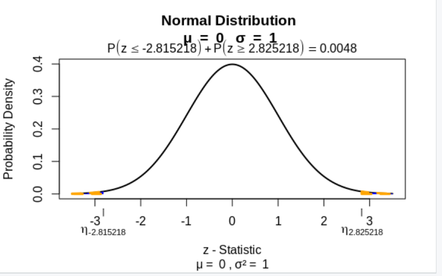

## Lab 7

#### Question 1

Bottles are produced with mean of 150cc and standard deviation of 2cc. Samples of 100 bottles show mean as 152cc. Has the mean value changed? Check with 95% confidence interval.

#### Code

The program can be found [here (Question1.R)](Question1.R)

#### Output

#### Question 2

In a health survey of school children, the mean of haemoglobin level of 55 boys is 11g per 100ml with a standard deviation of 2.1. Can we consider this group as taken from a population with a mean of 10.2g per 100ml.

#### Code

The program can be found [here (Question2.R)](Question2.R)

#### Output

